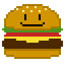

# Hello Pygame

This is a simple repository where I will creating basic stuff with pygame.

## Tools

The tools used in this repository are

* [python 3.9.2](https://www.python.org/)
* [pygame 2.1.0](www.pygame.org)

Also I made the repository in a raspberry pi 4.

## Scripts

Here is the collection of scripts and what does it show everysingle one of them.

### HelloWorld.py

Like always we star with a simple but usefull hello world in this file.

### HelloPygame.py

This is a simple script to show the basic creation of a screen with pygame.

### Sprite.py

In this script we show how to draw a image that is store in images called burgercito and show how to center it.

### ResizeSprite.py

Here we show how can we resize a sprite to make it the size we want it, and keep it centered programaticly

### Keyboard.py

In this cript we will make our new humingbird move around the skies, for tham matter we will teach how to use the keaybord as a controler as changing the background color of our screen.

